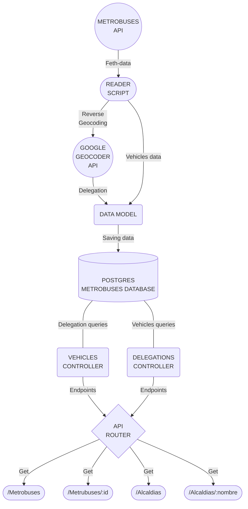
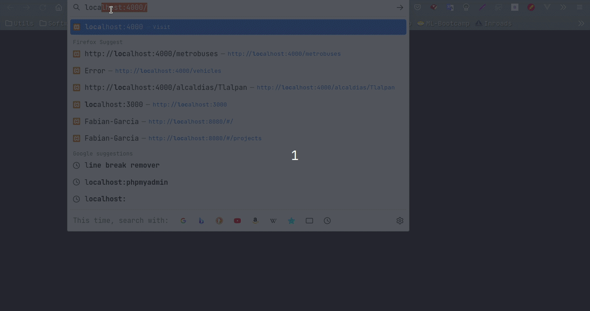
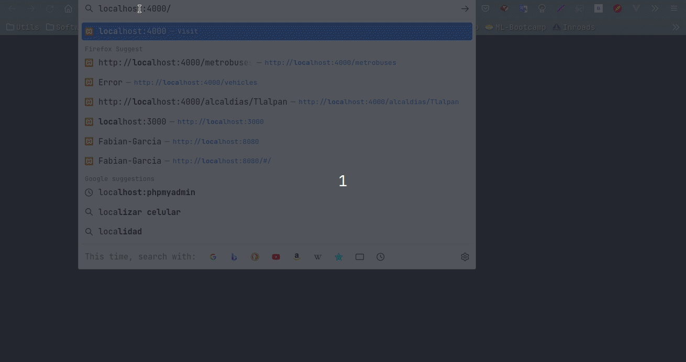
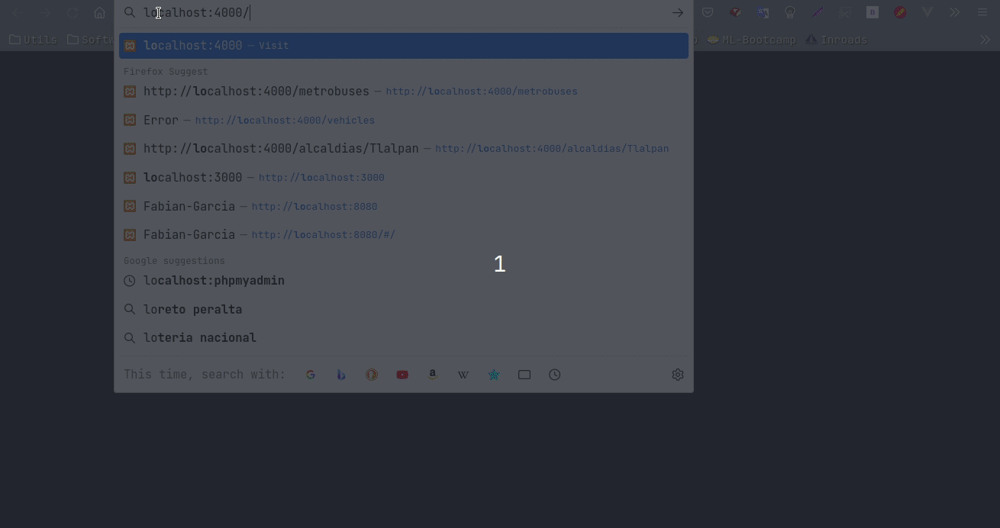
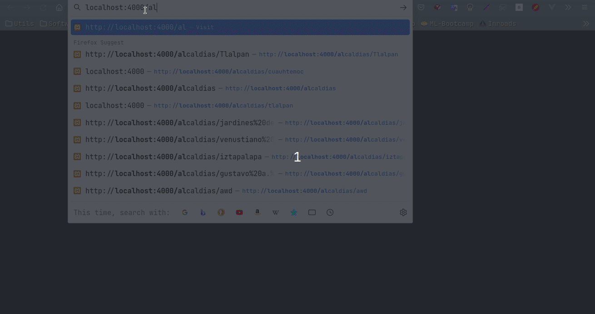

# **Prueba técnica: Data pipeline :star2:**

*Proyecto de pipeline de datos para obtener datos de las ubicaciones de autobuses de cdmx y mostrarlos en una API REST* :man_technologist:

---

## Indice
* [Descripción y requerimientos](#id0)
* [Diseño del proyecto](#id1)
  * [Dependencias y tecnologías](#id1.1)
  * [Diagrama de solución](#id1.2)
  * [Diseño de backend y endpoints](#id1.3)
* [Instalacion y ejecución](#id2)
* [Previsualización](#id3)

---

## Descripción :pencil:<a id="id0"></a>

<p>
Se solicitó desarrollar un pipeline de análisis de datos utilizando los datos abiertos de la Ciudad de México
correspondientes a las ubicaciones de las unidades del metrobús para que pueda ser
consultado mediante un API Rest filtrando por unidad o por alcaldía con las siguientes consideraciones:
</p>

* *Obtener una lista de unidades disponibles*
* *Consultar la ubicación de una unidad dado su ID*
* *Obtener una lista de alcaldías disponibles*
* *Obtener la lista de unidades que se encuentren dentro de una alcaldía*

---

## Diseño del proyecto :art:<a id="id1"></a>

Para la solución del problema se realizo un diseño del flujo de datos obtenidos desde los datos abiertos de metrobuses de CDMX para que finalmente puedan ser expuestos mediante un API. <br><br>

**Stack y dependencias** <a id="id1.1"></a>
* *[Node.JS](https://nodejs.org/en/)*
* *[Postgres](https://www.postgresql.org/)*
* *[Express](https://expressjs.com/)*
* *[Docker](https://www.docker.com/)*
* *[Pg(Node-Postgres)](https://node-postgres.com/)*
* *[Geocoder](https://www.npmjs.com/package/geocoder)*
* *[Axios](https://axios-http.com/docs/intro)*
* *[Jest](https://jestjs.io/)*
* *[Dotenv](https://www.npmjs.com/package/dotenv)*
* *[Sequelize](https://sequelize.org/)*

<br>

**Diagrama de solución** <a id="id1.2"></a>


<br>

Se siguio la siguiente Modelo de datos

| Field                    | DataType                 |
| -------------------------| ------------------------ |
| id                       | Integer (autogenerated)  |
| vehicle_id               | Integer                  |
| vehicle_label            | Integer                  |
| current_status           | SmallInt                 |
| latitude                 | Decimal                  |
| longitude                | Decimal                  |
| geographic_point         | String                   |
| position_speed           | Integer                  |
|position_odometer         | Integer                  |
|trip_schedule_relationship| Integer                  |
|trip_id                   | Integer                  |
|trip_start_date           | Integer                  |
|trip_route_id             | Integer                  |
|delegation                | String                   |
|address                   | String                   |


<br><br>

**Diseño de Backend y endpoints** <a id="id1.3"></a>



<br>

---

## Instalacion y Ejecución :wrench:<a id="id2"></a>

Para desplegar el servicio se requiere unicamente contar con docker y docker compose y ejecutar la siguiente serie de pasos:


```bash

  # Clona el repositorio
  git clone git@github.com:FabianGarciaXY/Data_pipeline.git

  # Construye la imagen
  cd Data_pipeline/ && docker compose build

  # Corre los contenedores
  docker compose up

```

<br>

Endpoints:

<br>

|            Endpoint                |        Request      |       Response                                    | Ejemplo                          |
| -----------------------------------|:-------------------:|:-------------------------------------------------:|:--------------------------------:|
| `localhost:4000/metrobuses`        |         GET         | Todas las unidades disponibles                    | `localhost:4000/metrobuses`      |
| `localhost:4000/metrobuses/:id`    |         GET         | Un vehiculo filtrado por id                       | `localhost:4000/metrobuses/3`    |
| `localhost:4000/alcaldias`         |         GET         | Una lista de las alcaldías disponibles            | `localhost:4000/alcaldias`       |
| `localhost:4000/alcaldias/:nombre` |         GET         | Una lista de las unidades disponibles por alcaldía|`localhost:4000/alcaldias/tlalpan`|


<br>

---

## Previsualización :computer:<a id="id3"></a>

<br>

Obtener una lista de unidades disponibles



<br><br>

Consultar la ubicación de una unidad dado su ID



<br><br>

Obtener una lista de alcaldías disponibles



<br><br>

Obtener la lista de unidades que se encuentren dentro de una alcaldía



<br><br>

---

<br><br>

Gracias :p
