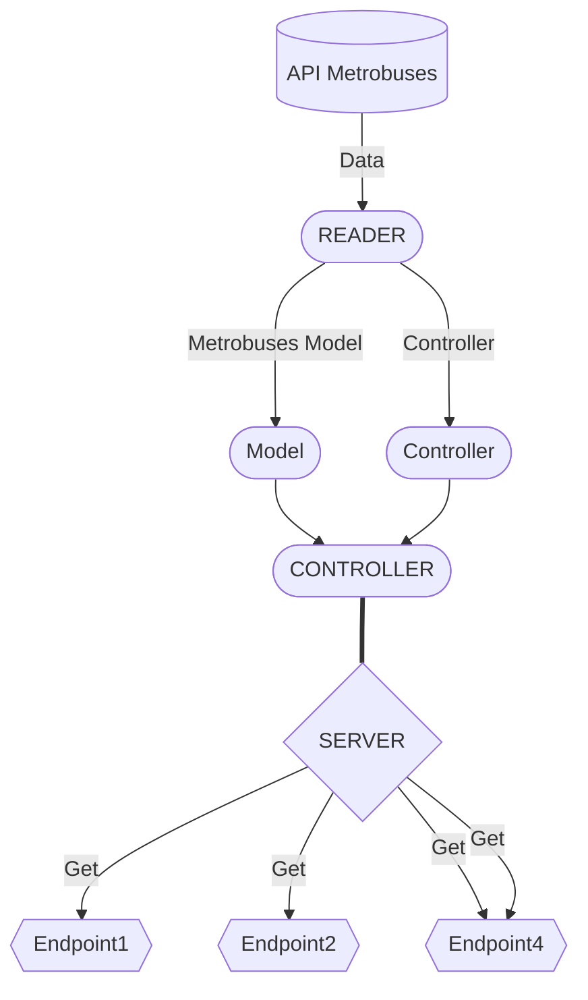

# **Prueba técnica: Data pipeline**

*Prueba tecnica como parte del proceso para desarrollador Backend con Scala en Ankor.*

---

## Indice
* [Descripción y requerimientos](#id0)
* [Diseño del proyecto](#id1)
  * [Dependencias y tecnologías](#id1.1)
  * [Diagrama de solución](#id1.2)
  * [Diseño de backend y endpoints](#id1.3)
  * [Obtencion de ubicaciones](#id1.4)
* [Instalacion y ejecución](#id2)
* [Demo](#id3)

---

## Descripción 

Se solicitó desarrollar un pipeline de análisis de datos utilizando los datos abiertos de la Ciudad de México
correspondientes a las ubicaciones de las unidades del metrobús para que pueda ser
consultado mediante un API Rest filtrando por unidad o por alcaldía con las siguientes consideraciones:

* ***Obtener una lista de unidades disponibles***
* ***Consultar la ubicación de una unidad dado su ID***
* ***Obtener una lista de alcaldías disponibles***
* ***Obtener la lista de unidades que se encuentren dentro de una alcaldía***

---

## Diseño del proyecto 

Para la solución del problema se realizo un diseño del flujo de datos obtenidos desde los datos abiertos de metrobuses de CDMX para que finalmente puedan ser expuestos mediante un API.   

**Dependencias y tecnologías** 

Se usaron las siguientes herramientas:

* *Node.JS*
* *Postgres*
* *Express*
* *Docker*
* *Axios*
* *Jest*
* *Sequelize ORM*
* *etc.*
  

**Diagrama de solución** 

 

**Diseño de backend y endpoints** 

Diagrama del backend

>FIX THIS

 

**Obtención de ubicaciones** 

 

---

## Instalacion y Ejecución 

Para desplegar el servicio se requiere unicamente contar con docker y docker compose y ejecutar la siguiente serie de pasos:

1. Primero
2. Segundo
3. Tercero

 

---

## Demo 

Obtener una lista de unidades disponibles

  

Consultar la ubicación de una unidad dado su ID

  

Obtener una lista de alcaldías disponibles

  

Obtener la lista de unidades que se encuentren dentro de una alcaldía

  

---

  
Licencia ISC
Gracias, :p